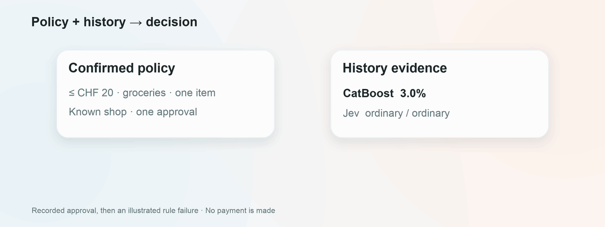

<picture>
  <source media="(prefers-reduced-motion: reduce)" srcset="docs/assets/readme/hero.png">
  
</picture>

# Leash

Purchase controls for AI shopping agents.

<p align="center">
  <a href="https://github.com/davidfarah2003/Bucheggang/releases/download/demo-2026-09-25/leash-user-flow.mp4">
    
  </a>
</p>

Leash gives your agent a spending policy that you review in the Wallet. You decide what it may buy, which merchants it may use and how much it may spend. Each submitted purchase is checked against those rules and earlier account activity. Decisions include the checks and reasons behind them.

Built for the [Viseca challenge](viseca-2026/challenge.md). This prototype records purchase authorizations; it doesn't place orders or process payments.

[How it works](#how-it-works) · [Architecture](#architecture) · [Classifier](#the-classifier) · [Run locally](#run-locally)

## How it works

1. Connect an MCP-compatible shopping agent. Approve its connection and access scopes in the Wallet.
2. Review the agent's proposed spending policy. Confirm the budget, product requirements and other limits before it can request purchases.
3. The agent submits a cart and final amount. Leash evaluates the request against the confirmed policy, spending state and purchase history.
4. Check the result in the Wallet. Requests needing your review wait for your answer and decline if the response window expires.

<picture>
  <source media="(prefers-reduced-motion: reduce)" srcset="docs/assets/readme/wallet.png">
  
</picture>

<sub>Recorded demo with scripted Wallet interactions. No payment is made. The reduced-motion view shows local example screens. The full video with sound is on the <a href="https://github.com/davidfarah2003/Bucheggang/releases/tag/demo-2026-09-25">release page</a>.</sub>

Demo music: "Wallpaper" by Kevin MacLeod (incompetech.com), [CC BY 4.0](https://creativecommons.org/licenses/by/4.0/). [Music credits](docs/demo/music/README.md). Re-record the video with `scripts/record_demo.py`.

The Wallet also lets you revoke an agent's access and edit account-wide spending rules. Those rule changes apply to later policy confirmations. An agent's connection alone grants no spending permission.

## Architecture

The Wallet is a browser app served by FastAPI. Agents connect to a separate MCP server over stdio or HTTP. Both use the policy and purchase services; the simulator runner uses the same extraction and evaluation modules.


Pydantic contracts carry purchase inputs, extracted facts and assessments between modules. The decision engine performs no network calls. CatBoost runs from a local calibrated model artifact; optional Jev requests go through OpenRouter. File-backed records use locks and atomic writes for policies, decisions and spending state.

[Technical contracts](docs/contracts.md) · [Agent connection and tools](docs/setup.md#connect-an-agent)

## The classifier

### History inputs and model outputs

CatBoost scores purchase and account-history features to estimate historical decline probability. Jev returns separate probability distributions for spending and activity patterns, each over `ordinary`, `unclear` and `unusual`. Both use activity from before the purchase.

<picture>
  <source media="(prefers-reduced-motion: reduce)" srcset="docs/assets/readme/classifier.png">
  
</picture>

CatBoost adds an uncertain check when its score reaches the configured review threshold. Jev adds uncertainty when the highest-probability answer is unusual, unclear or tied. These checks join the policy checks; neither model grants spending permission on its own.

### Combining policy and history

The engine checks the confirmed policy first. A failed rule means decline, and the configured evaluator skips model calls for that request. Otherwise, the model assessments contribute their checks to the final decision.

<picture>
  <source media="(prefers-reduced-motion: reduce)" srcset="docs/assets/readme/evidence.png">
  
</picture>

| Decision | What produces it |
| :--- | :--- |
| `approve` | Checks pass, or the confirmed policy permits the remaining uncertainty. |
| `decline` | A rule fails, or the policy requires declining uncertainty. |
| `step_up` | Uncertainty requires customer review in the Wallet. |

Conflicting facts cannot receive an automatic approval. The Wallet shows the decision reason and its evidence, including model outputs when available. Required assessments are bound to the purchase they describe; missing, invalid or timed-out assessments stop authorization.

<sub>Model values come from a [recorded offline composition](docs/eval/classifier-composition-2026-09-25.json). CatBoost escalation was disabled in that recording. The rule-failure branch is illustrated; no payment is represented.</sub>

## Run locally

Requires [Python 3.13+](https://www.python.org/downloads/) and [uv](https://docs.astral.sh/uv/getting-started/installation/).

```sh
git clone https://github.com/davidfarah2003/Bucheggang.git
cd Bucheggang
uv sync

export LEASH_POLICY_STORE="$PWD/data/policy"
export LEASH_APP_ORIGIN="http://127.0.0.1:8000"
export LEASH_ENABLE_MODELS=0

uv run python -m leash.api
```

Open http://127.0.0.1:8000/app/ and create a demo account. This starts the Wallet with model calls disabled. Simulator-backed confirmation requires the challenge configuration described in the setup guide.

Shop currently hands requests to an external MCP client. The in-app provider adapter is unfinished.

[Setup guide](docs/setup.md) · [Connect an agent](docs/setup.md#connect-an-agent) · [Replay the public inputs](docs/run-replay.md) · [Design](docs/idea/viseca-agent-control-layer.md)

## Contributors

<table>
  <tr>
    <td align="center">
      <a href="https://github.com/davidfarah2003">
        <br>
        <sub>David Farah</sub>
      </a>
    </td>
    <td align="center">
      <a href="https://github.com/deroskarmodulo">
        <br>
        <sub>Oskar Schmölz</sub>
      </a>
    </td>
    <td align="center">
      <a href="https://github.com/Rishabh-Barola">
        <br>
        <sub>Rishabh-Barola</sub>
      </a>
    </td>
  </tr>
</table>
