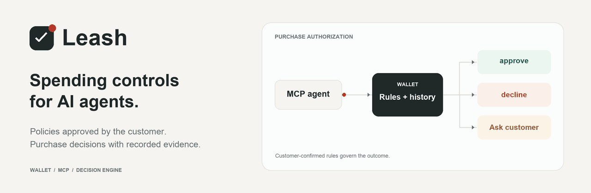

<picture>
  <source media="(prefers-color-scheme: dark) and (prefers-reduced-motion: reduce)" srcset="docs/assets/readme/hero-dark.png">
  <source media="(prefers-reduced-motion: reduce)" srcset="docs/assets/readme/hero-light.png">
  <source media="(prefers-color-scheme: dark)" srcset="docs/assets/readme/hero-dark.gif">
  
</picture>

<h1 align="center">Agent on a Leash</h1>

<p align="center">
  A customer Wallet and decision backend for purchases proposed by AI agents.
</p>

<p align="center">
  <a href="pyproject.toml"></a>
  <a href="docs/mcp-client.md"></a>
  <a href="docs/run-replay.md"></a>
  <a href="docs/live-demo-checklist.md"></a>
</p>

<p align="center">
  <a href="#inside-the-wallet">Product</a> ·
  <a href="#how-it-works">How it works</a> ·
  <a href="#quick-start">Quick start</a> ·
  <a href="#connect-an-agent">Connect an agent</a> ·
  <a href="#verification">Verification</a> ·
  <a href="#documentation">Documentation</a>
</p>

Leash gives a shopping agent a customer-confirmed spending policy. Proposed purchases are evaluated against that policy, with history, decision evidence and customer questions visible through the Wallet.

Customers control the budget, permitted products and merchants, purchase limits and treatment of uncertainty. The agent can propose a policy and request a purchase decision. Confirmation and purchase questions belong to the customer.

A one-minute recording of the whole flow, with the agent's MCP calls beside the Wallet, is at [docs/demo/leash-user-flow.mp4](docs/demo/leash-user-flow.mp4). Re-record it with `scripts/record_demo.py` (docstring has the steps). Music: "Wallpaper" by Kevin MacLeod (incompetech.com), [CC BY 4.0](https://creativecommons.org/licenses/by/4.0/); see [docs/demo/music](docs/demo/music/README.md).

> [!NOTE]
> This is a hackathon prototype for the Viseca challenge. Payment processing and order placement are outside the project. Shop currently hands requests to an external MCP-compatible agent; in-app provider execution is not implemented.

## Inside the Wallet


<sub>Captured from the application with a disposable local account. The example policy is unconfirmed. No purchase or payment is represented by these screenshots.</sub>

| Capability | What it does |
| :--- | :--- |
| Customer-confirmed policies | Stores versioned rules and a content hash. The customer reviews the saved policy in the Wallet before granting permission. |
| Scoped agent access | Pairs MCP clients with an account and issues revocable credentials. Drafts and purchase records are checked against their owner. |
| Spending controls | Enforces amount, product, merchant, quantity, purchase-count and rolling-budget constraints. Account-wide changes apply to later confirmations. |
| Personal history | Builds purchase-bound, pre-event history features. Optional behavioural and Jev assessments add risk information without overriding a hard rule failure. |
| Customer review | Routes `step_up` decisions to the Wallet. The customer answers; an unanswered purchase can expire to a decline. |
| Recorded outcomes | Keeps decisions, evidence and state on disk. Local purchase keys support idempotency; simulator calls have a separate recovery path. |

## How it works

1. Pair the agent with the Wallet. The customer approves the connection and its scopes.
2. Propose the spending policy. The agent turns the request into enforceable rules and leaves unresolved details visible for review.
3. Confirm in the Wallet. The backend checks the saved version and hash before creating the mandate.
4. Evaluate the purchase. The engine checks the cart, confirmed policy and current state. A customer question pauses the purchase until an answer or timeout is recorded.

| Result | Meaning |
| :--- | :--- |
| `approve` | The backend authorizes the proposed purchase under the evaluated policy. |
| `decline` | The purchase is refused, with recorded reasons. |
| `step_up` | A customer decision is required in the Wallet. |

Local MCP purchases and simulator authorizations are separate flows. A local `buy` does not create a simulator authorization or contribute to a simulator run or score.

## Quick start

Requires [Python 3.13+](https://www.python.org/downloads/) and [uv](https://docs.astral.sh/uv/getting-started/installation/). The Wallet is served by FastAPI; there is no frontend build step.

```sh
git clone https://github.com/davidfarah2003/Bucheggang.git
cd Bucheggang
uv sync

export LEASH_POLICY_STORE="$PWD/data/policy"
export LEASH_APP_ORIGIN="http://127.0.0.1:8000"
export LEASH_ENABLE_MODELS=0

uv run python -m leash.api
```

Open **http://127.0.0.1:8000/app/** and create a local demo account. This startup path runs without model credentials. Browsing the Wallet and drafting a policy do not establish a confirmed spending mandate.

### Simulator access

Simulator-backed confirmation and live runs require the challenge configuration. On a fresh checkout, create the ignored configuration file:

```sh
cp .env.example .env
```

Set the team key in that file. Keep it out of source control, terminal output and client configuration. Simulator credentials are handled by the runner settings module.

The Wallet, MCP server and runner must use the same checkout and `LEASH_POLICY_STORE`. `LEASH_APP_ORIGIN` must exactly match the Wallet origin, including its port.

### Optional risk models

The quick start explicitly disables model calls. Enabling them requires the `classifier` dependency group, a model manifest and the separately scoped OpenRouter credential. The demo launch scripts also configure local purchase budgets and can enable models by default. Inspect their settings before running them.

See the [classifier implementation and measurements](docs/eval/classifier/) and [runner configuration](src/leash/runner/settings.py). The optional `harness` dependency group belongs to the unfinished in-app provider adapter.

## Connect an agent

Leash supports MCP over stdio and streamable HTTP. The customer can approve a pending connection in the Wallet; the agent then uses the policy and purchase tools within its granted scopes.

<details>
<summary>Example stdio configuration for clients that use <code>mcpServers</code></summary>

Replace both absolute paths with your checkout location. These settings retain model-off operation.

```json
{
  "mcpServers": {
    "leash": {
      "command": "uv",
      "args": [
        "run",
        "--project",
        "/absolute/path/to/Bucheggang",
        "python",
        "-m",
        "leash.policy.mcp_server"
      ],
      "env": {
        "LEASH_POLICY_STORE": "/absolute/path/to/Bucheggang/data/policy",
        "LEASH_APP_ORIGIN": "http://127.0.0.1:8000",
        "LEASH_ENABLE_MODELS": "0"
      }
    }
  }
}
```

</details>

| Tool group | Tools |
| :--- | :--- |
| Connection | `connect`, `begin_pairing`, `complete_pairing` |
| Policy | `get_policy_authoring_instructions`, `propose_task_policy`, `get_policy_status`, `wait_for_policy`, `get_policy_summary` |
| Local purchase | `buy`, `get_purchase_status`, `wait_for_purchase` |

Purchasing requires a confirmed mandate, the purchase scope, a recorded card identity and configured purchase/step-up budgets. A successful connection alone grants no spending permission. No MCP tool confirms a policy or answers a purchase question for the customer.

[Client setup and transports](docs/mcp-client.md) · [Tool implementation](src/leash/policy/mcp_server.py) · [Purchase input contract](docs/contracts.md#purchase-input-and-idempotency)

## Verification

The public replay runs the real extractor, decision engine and in-memory state projection across five scenarios and 45 purchase attempts. It requires no simulator key or model calls.

```sh
uv run python scripts/replay.py --all \
  --policy SCEN0000=docs/eval/replay-policies/SCEN0000.json \
  --policy SCEN0001=docs/eval/replay-policies/SCEN0001.json \
  --policy SCEN0002=docs/samples/scen0002_draft.json \
  --policy SCEN0003=docs/eval/replay-policies/SCEN0003.json \
  --policy SCEN0004=docs/eval/replay-policies/SCEN0004.json \
  --output /tmp/leash-replay.csv
```

Choose a new output filename for a subsequent run. Existing reports are never overwritten.

| Recorded deterministic replay | Count |
| :--- | ---: |
| Inputs | 45 |
| Approve | 11 |
| Decline | 32 |
| Ask the customer | 2 |

These are decision counts, not accuracy percentages or live payment results. Provider exercises, simulator runs and human Wallet verification have separate evidence records.

[Replay assumptions and commands](docs/run-replay.md) · [Recorded exercises](docs/eval/) · [Live verification checklist](docs/live-demo-checklist.md)

## Architecture

```text
app/                       Customer Wallet and Shop interface
src/leash/
  api/                     Sessions, ownership checks and Wallet routes
  policy/                  Pairing, drafts, confirmation and local purchases
  extract/                 Deterministic facts and provenance
  engine/                  Rules, history features and optional risk models
  runner/                  Simulator calls, deadlines, state and recovery
docs/                      Contracts, plans and observed evidence
viseca-2026/               Organizer data and challenge material
```

The decision engine is separated from transport and persistence. Merchant text and agent-supplied facts carry provenance; they cannot edit the confirmed rules. Known instruction patterns and conflicting facts are handled explicitly. This is a measured deterministic boundary, with no claim of general prompt-injection immunity.

## Documentation

| Read | For |
| :--- | :--- |
| [Product design](docs/idea/viseca-agent-control-layer.md) | The customer journey and control model |
| [Contracts](docs/contracts.md) | Policy, decision, identity and purchase interfaces |
| [MCP client setup](docs/mcp-client.md) | Local and HTTP client configuration |
| [Offline replay](docs/run-replay.md) | Reproducible decision checks and their assumptions |
| [Classifier evidence](docs/eval/classifier/) | History features, model artifacts and measurements |
| [Delivery plan](docs/plans/07-end-to-end-delivery.md) | Remaining integration and verification work |

Built for the [Viseca Agent on a Leash challenge](viseca-2026/challenge.md). The Wallet uses local demo accounts; it does not provide a banking login.
