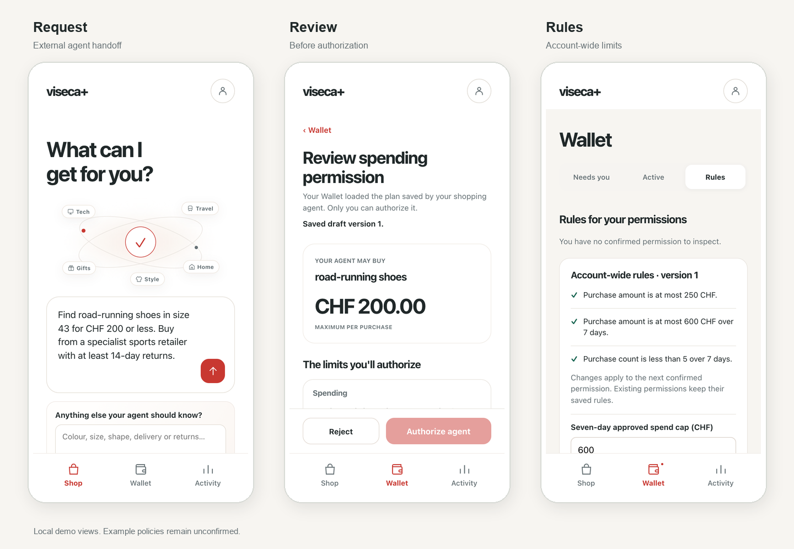
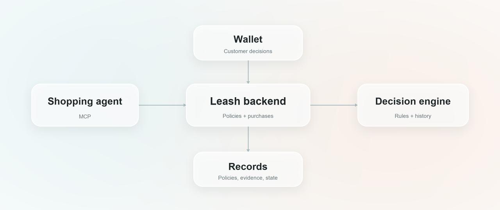
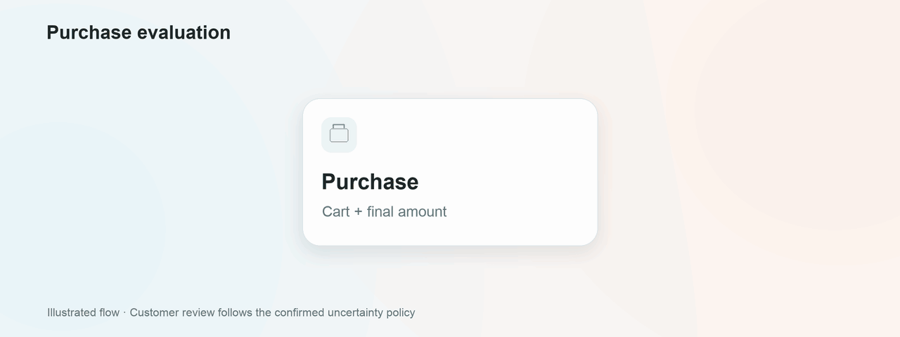

<picture>
  <source media="(prefers-reduced-motion: reduce)" srcset="docs/assets/readme/hero.png">
  
</picture>

Leash checks the purchases an AI shopping agent submits against rules you approve in the Wallet. Set a budget and choose what it may buy. Requests that need your approval appear in the Wallet.

[Watch the demo](docs/demo/leash-user-flow.mp4) · [Run locally](#run-locally) · [Connect an agent](docs/setup.md#connect-an-agent)



<sub>Local demo screens with an unconfirmed example policy.</sub>

Demo music: "Wallpaper" by Kevin MacLeod (incompetech.com), [CC BY 4.0](https://creativecommons.org/licenses/by/4.0/). [Music credits](docs/demo/music/README.md). Re-record the video with `scripts/record_demo.py`.

## Architecture



## The classifier

A failed policy rule means decline. The Wallet shows the checks and optional model output behind each decision. If a required assessment fails, the request stops.

<picture>
  <source media="(prefers-reduced-motion: reduce)" srcset="docs/assets/readme/classifier.png">
  
</picture>

<sub>The flow is illustrated. The Jev probabilities come from a [recorded response](docs/eval/jev-public-2026-09-25-evidence.json).</sub>

## Run locally

Requires [Python 3.13+](https://www.python.org/downloads/) and [uv](https://docs.astral.sh/uv/getting-started/installation/).

```sh
git clone https://github.com/davidfarah2003/Bucheggang.git
cd Bucheggang
uv sync

export LEASH_POLICY_STORE="$PWD/data/policy"
export LEASH_APP_ORIGIN="http://127.0.0.1:8000"
export LEASH_ENABLE_MODELS=0

uv run python -m leash.api
```

Open http://127.0.0.1:8000/app/ and create a demo account. Model calls are disabled in this setup. Shop hands requests to an external MCP client; the in-app provider adapter is unfinished.

[Simulator and model setup](docs/setup.md) · [Replay the public inputs](docs/run-replay.md) · [Design](docs/idea/viseca-agent-control-layer.md) · [Contracts](docs/contracts.md)

Built for the [Viseca challenge](viseca-2026/challenge.md). This prototype records purchase authorizations. It doesn't place orders or process payments.

## Contributors

<table>
  <tr>
    <td align="center">
      <a href="https://github.com/davidfarah2003">
        <br>
        <sub>David Farah</sub>
      </a>
    </td>
    <td align="center">
      <a href="https://github.com/deroskarmodulo">
        <br>
        <sub>Oskar Schmölz</sub>
      </a>
    </td>
    <td align="center">
      <a href="https://github.com/Rishabh-Barola">
        <br>
        <sub>Rishabh-Barola</sub>
      </a>
    </td>
  </tr>
</table>
