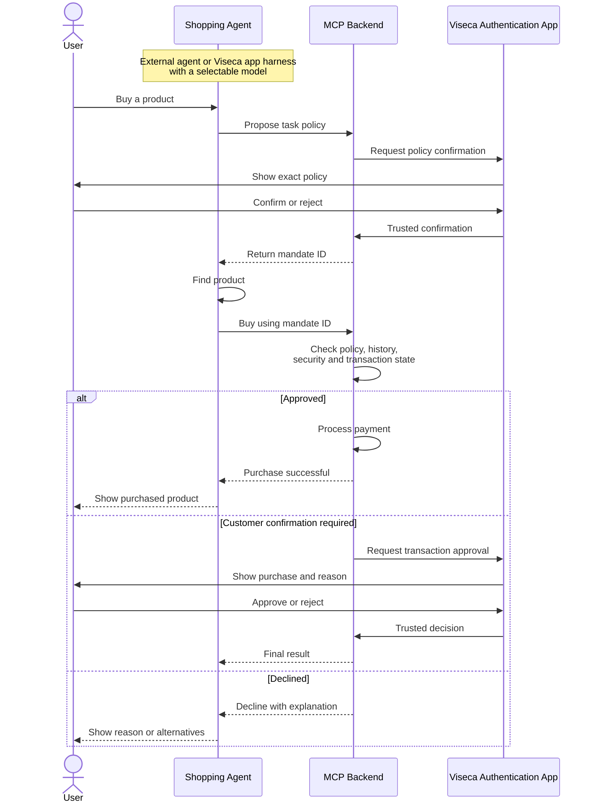
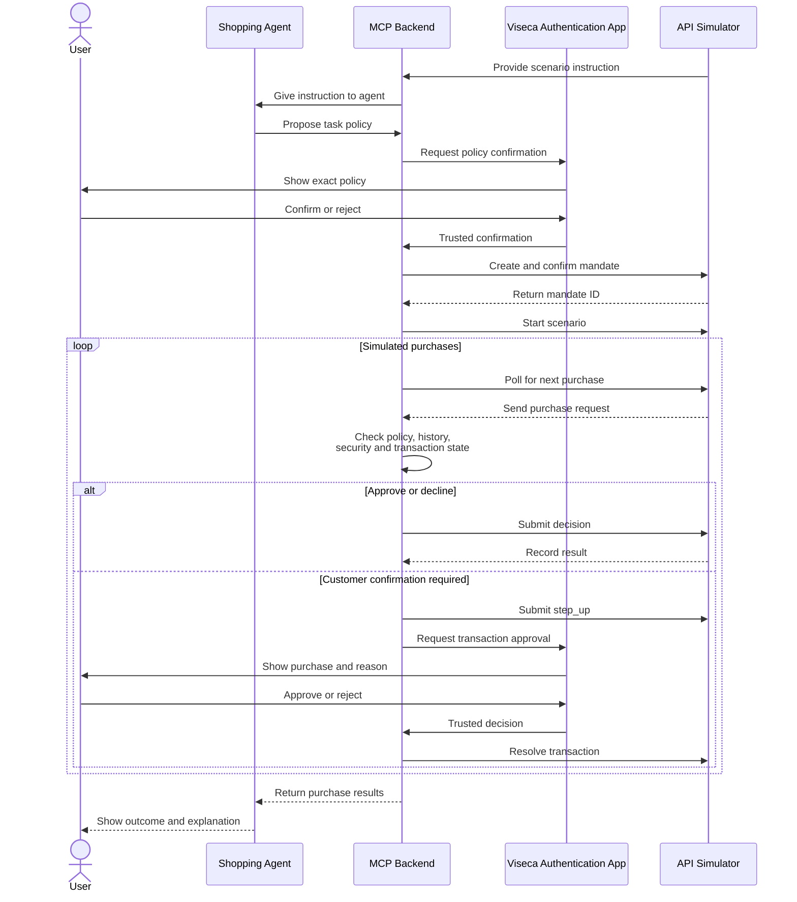

# Viseca Agent Payment Control Layer

## Product vision

Build an agent-independent payment control layer that allows AI shopping agents to make purchases without receiving card credentials or unrestricted payment access.

The shopping flow applies to any product or service category. Shoes in the examples are one scenario, not a product restriction. The agent derives a task policy from the customer's actual request and surfaces any detail that the available policy fields cannot enforce.

Customers can use either:

- an external shopping agent such as Claude, Codex, or another MCP-compatible agent; or
- a Viseca shopping app that acts as an agent harness and lets the customer choose the model or shopping agent. AG-UI could provide the interaction layer for this application.

Both options use the same MCP backend, policy system, decision engine, and Viseca authentication flow.

## Core responsibilities

### Shopping agent

The shopping agent:

- receives the customer's shopping request;
- proposes a task-specific spending policy through MCP;
- waits for the customer to confirm that policy;
- searches for a suitable product;
- submits the proposed purchase using the confirmed mandate;
- displays the result and explanation.

The shopping agent cannot confirm policies, approve its own exceptions, access payment credentials, modify global policies, or bypass the control layer.

### MCP backend

The MCP backend provides the common interface for external agents and the Viseca shopping app. Its responsibilities include:

- policy proposal and validation;
- policy storage and versioning;
- deterministic rule enforcement;
- rolling-spend and duplicate tracking;
- merchant, device, session, and behavioural risk checks;
- prompt-injection isolation;
- explainable `approve`, `decline`, and `step_up` decisions;
- payment processing only after approval.

Suggested MCP tools:

- `propose_task_policy`
- `get_policy_summary`
- `get_policy_status`
- `request_policy_confirmation`
- `get_user_context`
- `buy`
- `get_purchase_status`

Policy confirmation, global-policy administration, and customer resolution of a `step_up` must not be exposed as ordinary agent-callable tools.

### Viseca authentication app

The authenticated Viseca app is the trusted human approval surface. It manages:

- persistent global policies;
- task-policy review and confirmation;
- policy tightening and revocation;
- transaction step-up approval or rejection;
- policy and purchase history;
- evidence and decision explanations.

The app must load the policy directly from the trusted backend. It must never display a policy copy supplied by the shopping agent as if it were authoritative.

## Policy model

The product supports two policy levels.

### Global policies

Global policies are persistent account-level restrictions configured through an authenticated Viseca API or the Viseca app. Examples include:

- never purchase gift cards;
- ask before starting a subscription;
- maximum agent-shopping spend per month;
- blocked merchant categories or countries;
- require confirmation for unfamiliar merchants.

### Task policies

A task policy is created for a specific shopping request. For example:

- buy one pair of road-running shoes;
- size 43;
- maximum CHF 200;
- specialist sports retailer;
- return period of at least 14 days;
- valid for 24 hours;
- maximum one successful purchase.

The effective permission is always the intersection of all applicable restrictions:

```text
issuer limits
  ∩ global customer policy
  ∩ task-specific policy
  ∩ runtime security controls
```

A task policy may tighten a global policy but may never weaken it.

## Secure policy confirmation

The model may propose a policy, but it must never be trusted to report that the customer confirmed it.

The secure confirmation flow is:

1. The shopping agent submits a policy proposal.
2. The backend validates and converts it to canonical structured data.
3. The backend stores an immutable draft, version, and policy hash.
4. The authenticated Viseca app retrieves that exact draft directly from the backend.
5. The customer confirms or rejects it in the Viseca app.
6. The backend verifies that the confirmed draft and hash still match.
7. The backend activates the mandate and gives the shopping agent only an opaque `mandate_id`.

Any material policy change creates a new version and requires confirmation again.

When requesting a purchase, the agent sends the `mandate_id` and the purchase facts form (`PurchaseFacts` in `docs/contracts.md`). It does not resend the policy. The backend retrieves the confirmed policy internally, preventing the agent from silently changing the confirmed rules.

Policy confirmation and transaction confirmation are different actions:

- **Policy confirmation:** the customer authorizes future spending within defined boundaries.
- **Transaction step-up:** the customer reviews one specific ambiguous or risky purchase.

## Decision pipeline

For each proposed purchase, the backend should:

1. Validate the request schema, agent identity, and mandate state.
2. Retrieve the confirmed policy internally using the mandate ID.
3. Apply issuer restrictions and global policies.
4. Apply task-specific deterministic rules.
5. Check rolling spend, retries, duplicates, and previous decisions.
6. Treat merchant pages, product descriptions, and agent-generated content as untrusted data.
7. Read the purchase facts form the shopping agent filled (product type, size, return terms, gift card, subscription, protection plan, add-on) and the structured merchant fields, and parse untrusted item text deterministically for the same facts and for embedded instructions. Untrusted content can supply facts; it cannot modify the policy.
8. Evaluate merchant, device, session, and behavioural risk.
9. Return `approve`, `decline`, or `step_up` with evidence and a plain-language explanation.
10. Continue to payment only after a final approval.

No language model reads merchant text or fills the form on the backend's behalf. The shopping agent's model fills the form before it calls `buy`; the backend checks the form, and every explicit requirement, with deterministic rules. A bounded classifier over the customer's own purchase history (the Jev decision classifier, `docs/plans/07-classifier.md`) may add a risk signal in step 8; it never overrides a deterministic check and never reads merchant text.

Deterministic checks must remain the final authority for explicit requirements such as price limits, permitted categories, rolling budgets, mandate expiry, and maximum purchase count.

## Security requirements

- Keep card credentials, payment tokens, API credentials, and signing keys in trusted backend services.
- Give agents only opaque, scoped, and expiring mandate identifiers.
- Use strict schemas and allow-listed fields for all tool calls.
- Separate trusted instructions from untrusted merchant and product content.
- Bind customer confirmation to the exact canonical policy version.
- Maintain an audit trail for policy drafts, confirmations, decisions, and overrides.
- Make purchase handling idempotent using authorization IDs.
- Return only minimal history summaries to agents, not raw customer histories.
- Use stable merchant identifiers rather than merchant names alone.
- No model call over untrusted content in the decision path. A model that fails or times out raises and is logged; there are no fallback paths.
- Never allow an LLM or shopping agent to directly authorize or execute payment.

Prompt-injection detection is an additional signal, not the primary boundary. The main protection is structural: untrusted content can supply facts, but it cannot alter policy, confirm authority, or execute payment.

## Production flow



## Hackathon demo mode

The demo uses the same product architecture and decision engine. The Swiss AI Weeks API substitutes the real shopping and payment environment by providing scenario instructions, generating purchase requests, storing challenge mandates, and recording decisions.

### Demo flow

1. Obtain the scenario's exact `cardholder_instruction`.
2. Let the shopping agent or a selected model propose structured policy rules.
3. Validate the proposal deterministically.
4. Display the exact stored draft in the Viseca authentication app.
5. Let the user confirm or reject it.
6. Create the challenge mandate through `POST /v1/mandates`.
7. Confirm it through `POST /v1/mandates/{draft_id}/confirm`.
8. Store the returned `mandate_id`.
9. Start the scenario through `POST /v1/scenario-runs`.
10. Poll `GET /v1/decision-requests/next?wait=25`.
11. Pass every purchase through the same production decision pipeline.
12. Submit `approve`, `decline`, or `step_up` through the decision endpoint.
13. Display `step_up` requests in the Viseca app and submit the customer's answer through `/resolve`.
14. Show the final decision, evidence, and audit trail.

### Demo diagram



### Demo constraints

- Use the exact provided customer instruction.
- Do not hard-code behavior using scenario IDs, authorization IDs, or replay positions.
- Keep the challenge bearer key exclusively in the backend.
- Treat the challenge API as a simulator, not a real payment processor.
- Respect the automated decision deadline.
- Use simulated timestamps for spending windows and real time for response deadlines.
- Count only final approvals toward rolling spend.
- Do not count repeated delivery of the same authorization twice.
- Ensure the API-generated purchases pass through the real decision engine used by the product design.

## Demo presentation

Demonstrate:

1. A normal purchase approved with minimal friction.
2. A manipulated, unsafe, or ambiguous purchase receiving a useful intervention.
3. Task-policy confirmation in the authenticated Viseca app.
4. A transaction `step_up` resolved by the customer.
5. A decision explanation showing the policy, evidence, and security checks used.

## Scope statement

In production, the MCP backend connects shopping agents to real Viseca authorization and payment services. In the hackathon demo, the same backend connects to the challenge API simulator. The first-party Viseca shopping app is an optional agent harness, while external agents remain alternative clients of the same MCP tools and security boundary.
